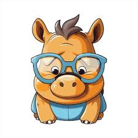

# Hands On: Bilder

## Einführung:

Nasi das Nashorn hat ein Problem, es wollte eine Fan-Seite über die bekannten fliegenden dortmunder Nashörner erstellen, und hat dafür ein fertiges Design gekauft, weiß aber leider nicht, wie man die Bilder auf der Seite einpflegt.

### Brief von Nasi dem Nashorn

Hallo du!

Mein Freund Rick hat mir erzählt, dass du richtig gut in HTML sein sollst, also dachte ich mir, ich schreib dir mal!

Ich wollte eine kleine Fan-Seite über die Tollen Geflügelten Nashörner aus Dortmund machen, aber ich glaube, ich habe mich damit etwas übernommen. Das Design ist schon fertig, aber ich weiss nicht wie ich die Bilder einfügen kann :(

Ich möchte 5 Bilder auf der Seite anzeigen und habe dir 4 davon mitgeschickt, es wäre schön, wenn du das Letzte selber auswählst!

Hoffentlich kannst du mir helfen, ich finde die Dortmunder Nashörner so toll!

Liebe Grüße,

Nasi das Nashorn

## Hauptziele

- Du lernst wie man bilder in HTML erstellt
- Du lernst wie du sie einbindest, sowohl lokal, wie auch aus dem Internet

## Aufgabe:

- Die Seite ist so weit fertig, mit dem vorhandenen CSS musst du dich also nicht befassen
- Füge 5 img-Elemente ein
- verlinke die vorhandenen 4 Bilder
- suche ein weiteres Bild aus dem Internet und verlinke es

